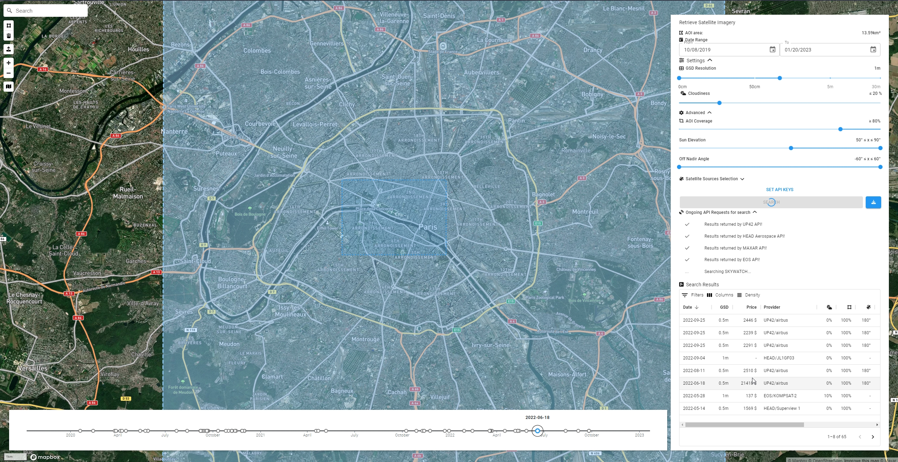

# search-satellite-imagery
Search satellite Imagery Archive on aggregators via their respective APIs (official or not), like:
 - [UP42](https://console.up42.com/catalog)
 - [SKYWATCH EarthCache](https://console.earthcache.com/search-archive)
 - [EOS Landviewer](https://eos.com/landviewer)
 - [HEAD Aerospace](https://headfinder.head-aerospace.eu/sales)
 - [MAXAR](https://discover.maxar.com) 
 - [SKYFI](https://app.skyfi.com/explore)



## Features
 - Set search settings (AOI polygon, dates and resolution), and advanced settings (cloud coverage, aoi coverage, sun elevation, off-nadir) and API keys
 - DrawControls on map to draw a rectangle, edit basemap style, import KML to set map bounds (aoi), control raster opacity, plus standards geocoder and map zoom, 
 - Search each API (official or not) and parse results
 - Displays results in a datagrid table with editable visible column, filter on one property, density, and auto fills sidepanel. Shows date, GSD, provider, and compute price and preview if not returned by API
 - Displays timeline with acquisition date of results
 - Hover over data table or timeline shows footprint on map and highlights date on timeline
 - Displays hovered or selected imagery on map (TMS or raster previews)
 - Stores UI and search params to localStorage (as well as search results). Also, checks localStorage object typeof (string, number, array, object) against fallbackState, and hasSameProperties (for objects) to avoid breaking changes in storage object name 
 - Pagination when more results than pagesize (up42 limit of 500 requests per page etc is handled, needs to check other providers pagination and eventually factorize code)

## Possible todos: 
### Short Term
 - Search any new STAC catalog (UP42 is one): Give it the STAC URL, parse results and columns to display in datagrid. Could use existing STAC tooling, but there does not seem to be any JS search client library - only full-fledged apps like [stac-server](https://github.com/stac-utils/stac-server) or [leaflet layer](https://github.com/stac-utils/stac-layer) and [stac-search](https://github.com/radiantearth/stac-browser/) (to deploy a stac, these are the go-to resource: [stac-fastapi](https://github.com/stac-utils/stac-fastapi) and pystac)
 - Cleanup: search-utilities, make each search extends a search object class, polygon aoi be a single feature search param, each geojson feature be a real geojson feature (search input, results)
 - Not easy: add react state feature to drawcontrol that can be edited (so polygon imported from kml or localstorage can be edited)
### Long Term
 - Helps order making (no deep-links for any platform unfortunately): make selection, export requests email with scene IDs
 - Order archive imagery via API (no tasking)
 - Not really useful: Sync datagrid focus on feature when hovered from timeline
 - Not really useful: Offer ability to Cancel ongoing request/promise. Hard to do, promise resolve will always execute after ky get/post request finally resolves

## Development
```bash
npm install
npm run start
npm run build
```

## Design choices
 - [visgl/react-map-gl](https://github.com/visgl/react-map-gl) v7 + mapbox-gl v2 [mapbox/mapbox-gl-draw](https://github.com/mapbox/mapbox-gl-draw)
 - [mui](https://mui.com/material-ui/getting-started/usage/) (previously material-ui) v5 components, inputs and datagrid
 - [ky](https://github.com/sindresorhus/ky) HTTP client (based on browser Fetch, more elegant)
 - [airbnb/visx](https://github.com/airbnb/visx) for charts and graphs
 - [font-awesome](https://fontawesome.com/icons) v6
 - [react-split-pane](https://github.com/tomkp/react-split-pane)  only supports react v16 ([issue](https://github.com/tomkp/react-split-pane/issues/713)) so switching to react-resizable-panels instead


### React-map module
react-map-gl vs react-mapbox-gl
 - nebula.gl built a [react-map-gl-draw](https://github.com/uber/nebula.gl/tree/master/examples/react-map-gl-draw) on top of react-map-gl [live example](https://nebula.gl/docs/interactive-examples/react-map-gl-draw-example) which is library agnostic (mapbox, maplibre, etc)
 - react-map-gl pre v7.0 had [perf drawbacks](https://github.com/visgl/react-map-gl/issues/1646), so they decided to use mapbox-gl as a peer-dependency (while letting the capability to use maplibre)
v7 is also better to use [3rd-party libs](https://github.com/visgl/react-map-gl/blob/master/docs/whats-new.md) like mapbox-gl-draw, mapbox-gl-geocoder rather than the react-map-gl-draw (which latest released version package.json uses react-map-gl ^5.0.0)

Two options:
 - CHOICE: go the react-map-gl route with mapbox-gl 3rd party libs [example](https://visgl.github.io/react-map-gl/examples/draw-polygon) more up to date already, but without the draw rectangle mode that can be added unless as a custom draw module (which was done)
 - use this nebula.gl [react-map-gl-draw-example](https://nebula.gl/docs/interactive-examples/react-map-gl-draw-example) and update react-map-gl-draw to v1.0.3 and react-map-gl to v6 works + react v16. updating to v7 requires following [this guide](https://github.com/visgl/react-map-gl/blob/master/docs/upgrade-guide.md), among which updating api key, adding mapbox-gl as dependency. Currently, react-mapbox-gl-draw does not support react-map-gl v7 as seen [here](https://github.com/HSLdevcom/jore4/issues/657), neither supports react 18 as of yet (same github board). So this solution was not chosen.


### Fetching POST/REST
ky (built on the Fetch api, has retries, simpler syntax) seem a better choice than axios (built on the older XmlHttpRequest api)

 - use ky (based on fetch) or axios (based on xmlhttprequest older) or pure fetch which are browser based
 - Other [list](https://developer.vonage.com/blog/2020/09/23/5-ways-to-make-http-requests-in-node-js-2020-edition)
 - Previous alternative discontinued: [request](https://nodesource.com/blog/express-going-into-maintenance-mode)
